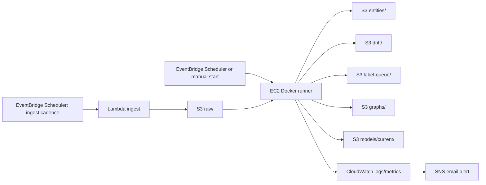

# AWS Free Tier Docker Tutorial

This tutorial is for a normal AWS account using Free Tier-style constraints.
It is different from Learner Lab:

- You control the account.
- You can create budgets, IAM roles, EventBridge schedules, Lambda functions, ECR repositories, and CloudWatch resources more freely.
- You still need to manage cost carefully because EC2 compute, public IPv4, EBS, NAT Gateway, and GPU instances can create charges.

If Docker, Git, Lambda, or EventBridge are new to you, read [BEGINNER_DOCKER_AWS_GIT_GUIDE.md](/C:/Users/gaurav/OneDrive/Desktop/MLOps/BEGINNER_DOCKER_AWS_GIT_GUIDE.md) first.

The recommended Free Tier-friendly architecture is:



Use:

- Lambda for ingestion.
- EC2 Docker for NER, drift, graph/dashboard, training, evaluation, and promotion.
- S3 for all durable artifacts.
- EventBridge Scheduler for timed ingestion.
- CloudWatch/SNS for observability and alerts.
- Terraform later after manual proof.

## Why This Version Is Different From Learner Lab

In a normal AWS account, you can run more realistic cloud automation.
But Free Tier does not mean every service is free.
The safest mindset is:

```text
Free Tier = helpful discounts and quotas, not unlimited free cloud.
```

For this project, avoid:

- NAT Gateway.
- Load Balancer.
- RDS.
- OpenSearch.
- Always-on GPU.
- Large SageMaker jobs.
- Public S3 buckets.

Use:

- S3.
- Lambda.
- EventBridge Scheduler.
- One small/medium EC2 instance when needed.
- CloudWatch/SNS lightly.

## Phase 0: Cost Guardrails

### Create AWS Budget

Create a monthly cost budget before launching EC2.

Recommended:

```text
Budget amount: 20 USD
Alert 1: actual cost > 50%
Alert 2: forecasted cost > 80%
Alert email: your email
```

Why:

- EC2, EBS, and public IPv4 can cost money even in a "free tier" workflow.
- Budget alerts catch mistakes early.

### Region

Use:

```text
us-east-1
```

Why:

- The repo defaults to `us-east-1`.
- Most services are available.
- It keeps IAM policies, S3, Lambda, and EventBridge simpler.

## Phase 1: S3 Bucket

Create:

```text
ai-news-mlops-<your-name>-2026
```

Settings:

```text
Region: us-east-1
Object ownership: ACLs disabled
Block all public access: enabled
Bucket versioning: enabled
Default encryption: SSE-S3
Object Lock: disabled
```

Create prefixes:

```text
raw/
processed/
entities/
drift/
label-queue/
labeled/
review/
eval/
graphs/
models/current/
models/candidate/
logs/
```

Lifecycle rules:

```text
raw/ expires after 30 days
label-queue/ expires after 60 days
models/ no expiry
graphs/ no expiry during project demo period
```

Why:

- S3 is the source of truth.
- Versioning protects model artifacts.
- Lifecycle rules keep old raw data from quietly growing.

## Phase 2: IAM Roles

### EC2 Role

Create:

```text
ai-news-mlops-ec2-role
```

Trusted service:

```text
EC2
```

Attach:

```text
AmazonSSMManagedInstanceCore
```

Inline policy:

```json
{
  "Version": "2012-10-17",
  "Statement": [
    {
      "Effect": "Allow",
      "Action": "s3:ListBucket",
      "Resource": "arn:aws:s3:::ai-news-mlops-your-name-2026"
    },
    {
      "Effect": "Allow",
      "Action": [
        "s3:GetObject",
        "s3:PutObject",
        "s3:DeleteObject",
        "s3:GetObjectVersion"
      ],
      "Resource": "arn:aws:s3:::ai-news-mlops-your-name-2026/*"
    },
    {
      "Effect": "Allow",
      "Action": "cloudwatch:PutMetricData",
      "Resource": "*",
      "Condition": {
        "StringEquals": {
          "cloudwatch:namespace": "AI/NewsNER"
        }
      }
    }
  ]
}
```

Why:

- EC2 can read/write project artifacts.
- SSM lets you connect without relying only on SSH.
- CloudWatch metrics are scoped to one namespace.

### Lambda Ingest Role

Create:

```text
ai-news-mlops-lambda-ingest-role
```

Trusted service:

```text
Lambda
```

Inline policy:

```json
{
  "Version": "2012-10-17",
  "Statement": [
    {
      "Effect": "Allow",
      "Action": "s3:ListBucket",
      "Resource": "arn:aws:s3:::ai-news-mlops-your-name-2026"
    },
    {
      "Effect": "Allow",
      "Action": [
        "s3:PutObject",
        "s3:GetObject"
      ],
      "Resource": "arn:aws:s3:::ai-news-mlops-your-name-2026/*"
    },
    {
      "Effect": "Allow",
      "Action": [
        "logs:CreateLogGroup",
        "logs:CreateLogStream",
        "logs:PutLogEvents"
      ],
      "Resource": "*"
    }
  ]
}
```

Why:

- Lambda only writes raw RSS batches to S3.
- It does not need EC2, IAM admin, or model permissions.

### EventBridge Scheduler Role For Lambda

EventBridge Scheduler needs permission to invoke the ingest Lambda.

Create:

```text
ai-news-mlops-scheduler-lambda-role
```

Trusted service:

```text
scheduler.amazonaws.com
```

Inline policy:

```json
{
  "Version": "2012-10-17",
  "Statement": [
    {
      "Effect": "Allow",
      "Action": "lambda:InvokeFunction",
      "Resource": "arn:aws:lambda:us-east-1:<account-id>:function:ai-news-mlops-ingest"
    }
  ]
}
```

Why:

- CloudWatch alarms observe metrics and send alerts.
- EventBridge Scheduler invokes Lambda on a time schedule.
- These are separate responsibilities.

## Phase 3: Lambda Ingest

For `ingest.py`, use a normal Lambda ZIP first.
Do not use Docker/ECR unless the ZIP path becomes painful.

Build ZIP locally or on EC2:

```bash
mkdir -p lambda_build
python3 -m pip install feedparser -t lambda_build
cp lambda_ingest.py ingest.py config.py s3_utils.py lambda_build/
cd lambda_build
zip -r ../lambda_ingest.zip .
cd ..
```

Lambda settings:

```text
Function name: ai-news-mlops-ingest
Runtime: Python 3.11
Architecture: x86_64
Handler: lambda_ingest.handler
Memory: 256 MB
Timeout: 60 seconds
Role: ai-news-mlops-lambda-ingest-role
```

Environment:

```text
LOCAL_MODE=false
S3_BUCKET=ai-news-mlops-your-name-2026
AWS_DEFAULT_REGION=us-east-1
```

Test event:

```json
{}
```

Expected:

```text
statusCode: 200
body: ingest complete
```

Verify:

```bash
aws s3 ls s3://ai-news-mlops-your-name-2026/raw/ --recursive
```

## Phase 4: EventBridge Schedule For Ingest

Yes, scheduling needs EventBridge Scheduler.
CloudWatch is for metrics and alarms; it does not replace the ingestion schedule.

Create EventBridge Scheduler:

```text
Name: ai-news-mlops-ingest-hourly
Pattern: rate(1 hour)
Flexible time window: off
Target: Lambda function
Function: ai-news-mlops-ingest
Execution role: ai-news-mlops-scheduler-lambda-role
```

Cost-safe option:

```text
rate(3 hours)
```

Why:

- Lambda is cheap for this lightweight task.
- EC2 does not need to run all day just to fetch RSS.
- EventBridge Scheduler supports rate and cron expressions and invokes the Lambda asynchronously.
- Use Scheduler rather than legacy EventBridge scheduled rules for new work.

Suggested schedules:

```text
Development: rate(6 hours)
Demo week: rate(1 hour)
High activity test: rate(30 minutes)
```

Use `rate(6 hours)` first to reduce noise and cost while debugging.

Optional cron example:

```text
cron(0 8,14,20 * * ? *)
```

This runs three times per day in UTC.

Debug check:

```bash
aws s3 ls s3://$S3_BUCKET/raw/ --recursive
```

If no new raw file appears:

- Check Lambda test works manually.
- Check Scheduler is enabled.
- Check Scheduler execution role has `lambda:InvokeFunction`.
- Check Lambda environment has `LOCAL_MODE=false` and the correct `S3_BUCKET`.

## Phase 5: EC2 Docker Runner

### Instance Choice

Recommended for Free Tier-style simplicity:

```text
t3.large
```

If the account has enough budget and you want fewer memory issues:

```text
t3.xlarge
```

Avoid for Free Tier-style project:

```text
g4dn.xlarge
```

unless you explicitly accept GPU cost.

Why:

- BERT inference and small training are too heavy for `t2.micro`.
- `t3.large` is a reasonable CPU compromise.
- `t3.xlarge` is smoother but costs more.

### EC2 Settings

```text
AMI: Amazon Linux 2023 or Ubuntu 22.04
Storage: 60-100 GB gp3, encrypted
IAM role: ai-news-mlops-ec2-role
Security group:
  inbound SSH 22 from My IP only
  inbound TCP 8000 from My IP only
  inbound TCP 8501 from My IP only
  outbound all traffic
```

Why:

- Port `8000` is for simple static dashboard serving.
- Port `8501` is for optional Streamlit later.
- Do not allow inbound `0.0.0.0/0` for SSH.

## Phase 6: Install Docker On EC2

Amazon Linux 2023:

```bash
sudo dnf update -y
sudo dnf install docker git -y
sudo systemctl enable docker
sudo systemctl start docker
sudo usermod -aG docker ec2-user
newgrp docker
```

Ubuntu:

```bash
sudo apt-get update -y
sudo apt-get install -y docker.io git
sudo systemctl enable docker
sudo systemctl start docker
sudo usermod -aG docker ubuntu
newgrp docker
```

Verify:

```bash
docker --version
docker run --rm hello-world
```

## Phase 7: Clone Repo And Configure

```bash
sudo mkdir -p /opt/ai-news-mlops
sudo chown -R $USER:$USER /opt/ai-news-mlops
cd /opt/ai-news-mlops
git clone https://github.com/st126522-rgb/MLOps.git
cd MLOps
```

If already cloned:

```bash
cd /opt/ai-news-mlops/MLOps
git pull
```

Create `.env`:

```bash
cp .env.example .env
nano .env
```

Use:

```text
LOCAL_MODE=false
S3_BUCKET=ai-news-mlops-your-name-2026
AWS_DEFAULT_REGION=us-east-1
LABEL_CONFIDENCE_THRESH=0.85
DRIFT_LOW_CONFIDENCE_THRESH=0.70
RUN_INGEST_IN_EC2=false
STOP_EC2_AFTER_RUN=false
```

Verify AWS role:

```bash
aws sts get-caller-identity
aws s3 ls s3://$S3_BUCKET/
```

## Phase 8: Build Docker Image

```bash
docker build -t ai-news-mlops:latest .
```

Why:

- This locks the Python/Torch/Transformers environment into a repeatable image.
- EC2 no longer depends on a fragile manual venv.

Test:

```bash
docker run --rm --env-file .env ai-news-mlops:latest python -c "import torch, transformers; print(torch.__version__); print(transformers.__version__)"
```

## Phase 9: Run Processing Pipeline

If Lambda has already written raw files:

```bash
chmod +x scripts/run_cloud_pipeline_docker.sh
RUN_INGEST_IN_EC2=false scripts/run_cloud_pipeline_docker.sh
```

If Lambda is not ready:

```bash
RUN_INGEST_IN_EC2=true scripts/run_cloud_pipeline_docker.sh
```

What the script does:

```text
Builds the Docker image.
Runs NER against S3 raw data.
Writes entities, drift logs, and label queue to S3.
Syncs S3 artifacts into local_data for graph/dashboard generation.
Generates graph/dashboard HTML.
Uploads HTML to S3 graphs/.
```

## Phase 10: View Dashboard

Serve from EC2:

```bash
cd /opt/ai-news-mlops/MLOps/local_data/graphs
python3 -m http.server 8000
```

Open:

```text
http://<ec2-public-ip>:8000/
```

Security group must allow inbound TCP `8000` from your IP.

You can also download from S3:

```bash
aws s3 ls s3://$S3_BUCKET/graphs/
```

## Phase 11: Training And Promotion

Training stays on EC2 Docker.

Sync current artifacts:

```bash
aws s3 sync s3://$S3_BUCKET/label-queue local_data/label-queue --quiet
aws s3 sync s3://$S3_BUCKET/labeled local_data/labeled --quiet
aws s3 sync s3://$S3_BUCKET/eval local_data/eval --quiet
aws s3 sync s3://$S3_BUCKET/models/current local_data/models/current --quiet || true
```

Export review CSV:

```bash
docker run --rm --env-file .env -v $(pwd)/local_data:/app/local_data ai-news-mlops:latest python label_review.py export --limit 200
```

Edit:

```text
local_data/review/label_review.csv
```

Build datasets:

```bash
docker run --rm --env-file .env -v $(pwd)/local_data:/app/local_data ai-news-mlops:latest python label_review.py build-datasets
```

Train:

```bash
docker run --rm --env-file .env -v $(pwd)/local_data:/app/local_data -v ai_news_hf_cache:/cache/huggingface ai-news-mlops:latest python train.py --epochs 1 --max-samples 100 --overwrite
```

Evaluate:

```bash
docker run --rm --env-file .env -v $(pwd)/local_data:/app/local_data -v ai_news_hf_cache:/cache/huggingface ai-news-mlops:latest python eval.py --model-prefix models/current --upload-results --current-result
docker run --rm --env-file .env -v $(pwd)/local_data:/app/local_data -v ai_news_hf_cache:/cache/huggingface ai-news-mlops:latest python eval.py --model-prefix models/candidate --upload-results --candidate-result
docker run --rm --env-file .env -v $(pwd)/local_data:/app/local_data -v ai_news_hf_cache:/cache/huggingface ai-news-mlops:latest python eval.py --check-gate
```

Promote if gate passes:

```bash
docker run --rm --env-file .env -v $(pwd)/local_data:/app/local_data ai-news-mlops:latest python promote_model.py
aws s3 sync local_data/models/current s3://$S3_BUCKET/models/current --delete
aws s3 sync local_data/eval s3://$S3_BUCKET/eval
```

Why:

- `NER.py` now loads `models/current` if a real promoted model exists.
- If no promoted model exists, it falls back to the base Hugging Face model.

## Phase 12: Optional CloudWatch/SNS

Minimum version:

- Inspect logs in EC2 terminal.
- Inspect drift reports in S3.

Better Free Tier version:

- Create SNS topic `ai-news-mlops-alerts`.
- Add a small metric publisher later for:
  - `MeanConfidence`
  - `FlaggedSpanPercentage`
  - `LabelQueueSize`
  - `DriftDetected`

Start with one alarm:

```text
DriftDetected >= 1
```

Why:

- Easier than a composite alarm for the first cloud version.
- Still fulfills drift monitoring and alerting.

## Phase 13: Optional EC2 Start/Stop Automation

Free Tier-style safe option:

- Start EC2 manually when processing.
- Run Docker pipeline.
- Stop EC2 manually.

More automated:

```text
EventBridge Scheduler
-> Lambda start EC2
-> SSM Run Command runs scripts/run_cloud_pipeline_docker.sh
-> EC2 stops itself with STOP_EC2_AFTER_RUN=true
```

Do this only after the manual Docker script works.

Recommended split:

```text
Schedule 1: EventBridge Scheduler -> Lambda ingest, every 1-6 hours.
Schedule 2: manual or daily EventBridge/SSM -> EC2 Docker processing.
```

Why not run EC2 every hour immediately:

- NER is the expensive/heavy stage.
- Ingest can collect raw articles cheaply.
- Processing once per day is enough for a learner/demo pipeline unless you need near-real-time graphs.

## Phase 14: Terraform Later

After this works manually, Terraform should create:

- S3 bucket and lifecycle rules.
- IAM EC2 role.
- IAM Lambda role.
- Lambda function.
- EventBridge Scheduler.
- EC2 security group.
- EC2 instance.
- Optional SNS topic.
- Optional CloudWatch alarms.
- Optional Step Functions state machine.

Do not Terraform a broken manual architecture.
Terraform should freeze what already works.

## Acceptance Criteria

Free Tier Docker architecture is done when:

- Lambda writes raw RSS batches to S3.
- EC2 Docker runs NER from S3 raw data.
- Drift reports and label queue are written to S3.
- Dashboard HTML is generated and uploaded to S3.
- A reviewed CSV can produce train/eval datasets.
- Candidate training runs in Docker.
- Eval gate can pass/fail the candidate.
- Promotion syncs `models/current` to S3.
- Later NER runs use the promoted model.
- EC2 can be stopped when not needed.
