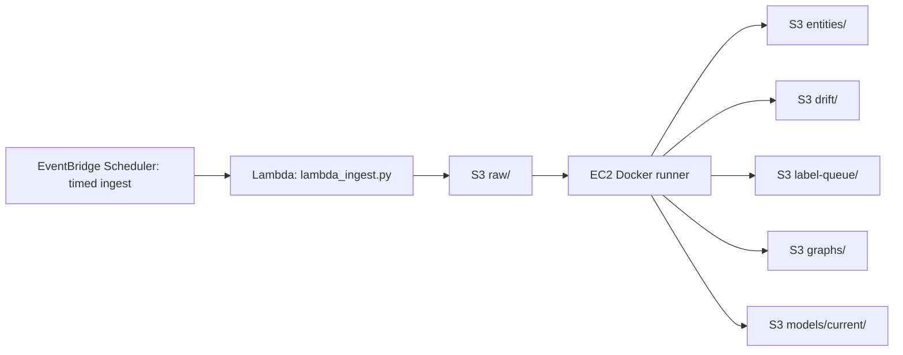

# AWS Learner Lab Docker Tutorial

This is the practical path from your current EC2 setup to a Docker-based AWS learner-lab deployment.
The goal is to remove Python dependency drift while keeping the architecture simple.

Use this guide for AWS Academy Learner Lab or any constrained classroom account.
If you are using a normal personal AWS account, use [AWS_FREE_TIER_DOCKER_TUTORIAL.md](/C:/Users/gaurav/OneDrive/Desktop/MLOps/AWS_FREE_TIER_DOCKER_TUTORIAL.md) instead.
If Docker, Git, Lambda, or EventBridge are new to you, read [BEGINNER_DOCKER_AWS_GIT_GUIDE.md](/C:/Users/gaurav/OneDrive/Desktop/MLOps/BEGINNER_DOCKER_AWS_GIT_GUIDE.md) first.

Learner Lab priorities:

- Spend credits slowly.
- Avoid services that may be unavailable or restricted.
- Treat EC2 as an on-demand worker, not an always-on server.
- Prefer manual start/run/stop over fully automated always-on scheduling.
- Keep S3 as the permanent source of truth because lab EC2 sessions may stop.

Current good state:

- EC2 can reach AWS.
- `aws sts get-caller-identity` works.
- EC2 can list the S3 bucket.
- `python ingest.py` writes raw data to S3.

Current pain:

- Manual Python environments can drift from the repo version.
- `NER.py` can fail if an old version tries to load an empty `models/current` folder.
- Torch/Transformers installs are heavy and easy to mismatch.

Docker fixes the dependency problem by putting the Python runtime and packages into an image.

## Target Architecture



Use Lambda only for ingestion.
Keep NER, graph, training, eval, and dashboard on EC2 Docker.
Use EventBridge Scheduler to invoke the ingest Lambda.
Use manual EC2 start/run/stop for the heavy Docker worker unless your Learner Lab allows more automation.

Why:

- `ingest.py` is lightweight and Lambda-friendly.
- NER/training uses heavy `torch` and `transformers`.
- EC2 Docker keeps the heavy ML environment reproducible.
- Learner Lab credits last longer when EC2 can be stopped after work.

## Important Repo Version Fix

Before using Docker on EC2, make sure your EC2 clone has the latest files from GitHub.

```bash
cd /opt/ai-news-mlops/MLOps
git pull
```

If `git pull` does not bring these files, your local repo has changes that are not pushed yet:

```text
Dockerfile
.dockerignore
docker-compose.yml
.env.example
lambda_ingest.py
scripts/run_cloud_pipeline_docker.sh
AWS_LEARNER_LAB_DOCKER_TUTORIAL.md
```

Also check `NER.py`.
It should contain this behavior:

```text
If models/current/config.json exists -> load promoted model.
If S3 models/current has real model files -> download and load promoted model.
Otherwise -> fall back to dslim/bert-base-NER.
```

This prevents the empty-folder model-loading error.

## Phase 1: Install Docker On Learner Lab EC2

Your commands show Amazon Linux, because you used `yum` and `dnf`.
Use this:

```bash
sudo dnf update -y
sudo dnf install docker git -y
sudo systemctl enable docker
sudo systemctl start docker
sudo usermod -aG docker ec2-user
```

Then log out and back in, or run:

```bash
newgrp docker
```

Verify:

```bash
docker --version
docker run --rm hello-world
```

If your username is `ubuntu` instead of `ec2-user`, use:

```bash
sudo usermod -aG docker ubuntu
newgrp docker
```

Why:

- Docker needs the service running.
- Adding your user to the `docker` group avoids needing `sudo docker` every time.

## Phase 2: Prepare Repo And Environment

```bash
sudo mkdir -p /opt/ai-news-mlops
sudo chown -R $USER:$USER /opt/ai-news-mlops
cd /opt/ai-news-mlops
```

Clone if needed:

```bash
git clone https://github.com/st126522-rgb/MLOps.git
cd MLOps
```

If already cloned:

```bash
cd /opt/ai-news-mlops/MLOps
git pull
```

Create `.env`:

```bash
cp .env.example .env
nano .env
```

Use:

```text
LOCAL_MODE=false
S3_BUCKET=ai-news-mlops-2026
AWS_DEFAULT_REGION=us-east-1
LABEL_CONFIDENCE_THRESH=0.85
DRIFT_LOW_CONFIDENCE_THRESH=0.70
```

Optional learner-lab setting:

```text
STOP_EC2_AFTER_RUN=false
RUN_INGEST_IN_EC2=false
```

Why:

- `.env` keeps config outside code.
- `LOCAL_MODE=false` tells the scripts to use S3.
- `RUN_INGEST_IN_EC2=false` assumes Lambda handles ingest later.

## Phase 3: Build Docker Image

From repo root:

```bash
cd /opt/ai-news-mlops/MLOps
docker build -t ai-news-mlops:latest .
```

This may take time because `torch` and `transformers` are large.
That is normal.

If the EC2 disk fills up:

```bash
df -h
docker system df
```

Clean unused Docker cache:

```bash
docker system prune -f
```

Learner Lab recommendation:

- Use at least `60-100 GB` EBS if allowed.
- Docker plus Hugging Face cache can become large.

## Phase 4: Run Cloud Pipeline Pieces With Docker

Test AWS access inside the container:

```bash
docker run --rm \
  --env-file .env \
  -v ~/.aws:/root/.aws:ro \
  ai-news-mlops:latest \
  python -c "import boto3; print(boto3.client('sts').get_caller_identity())"
```

If EC2 has an IAM role, you usually do not need `-v ~/.aws:/root/.aws:ro`.
The container can use the EC2 instance metadata credentials.

Run ingest in Docker only if Lambda is not ready:

```bash
docker run --rm \
  --env-file .env \
  -v $(pwd)/local_data:/app/local_data \
  -v ai_news_hf_cache:/cache/huggingface \
  ai-news-mlops:latest \
  python ingest.py
```

Run NER:

```bash
docker run --rm \
  --env-file .env \
  -v $(pwd)/local_data:/app/local_data \
  -v ai_news_hf_cache:/cache/huggingface \
  ai-news-mlops:latest \
  python NER.py
```

Expected behavior:

```text
Loading NER model: dslim/bert-base-NER
```

If you already uploaded a promoted model to `s3://bucket/models/current/`, expected behavior:

```text
Loading NER model: /tmp/...
```

Run drift:

```bash
docker run --rm \
  --env-file .env \
  -v $(pwd)/local_data:/app/local_data \
  -v ai_news_hf_cache:/cache/huggingface \
  ai-news-mlops:latest \
  python drift.py
```

If drift is detected, `drift.py` may exit with code `1`.
That is expected business logic, not necessarily a crash.

## Phase 5: Use The Docker Wrapper Script

Make the script executable:

```bash
chmod +x scripts/run_cloud_pipeline_docker.sh
```

Run without Lambda ingest:

```bash
RUN_INGEST_IN_EC2=true scripts/run_cloud_pipeline_docker.sh
```

Run after Lambda ingest is working:

```bash
RUN_INGEST_IN_EC2=false scripts/run_cloud_pipeline_docker.sh
```

Log output:

```bash
scripts/run_cloud_pipeline_docker.sh 2>&1 | tee -a /opt/ai-news-mlops/pipeline.log
```

Optional stop-after-run for Learner Lab:

```bash
STOP_EC2_AFTER_RUN=true scripts/run_cloud_pipeline_docker.sh
```

Why:

- Learner Lab should not run EC2 24/7.
- This lets EC2 behave like an on-demand worker.

## Phase 6: Create Lambda For Ingestion

Use Lambda for ingest because it is lightweight.

### IAM Role For Lambda

Create role:

```text
ai-news-mlops-lambda-ingest-role
```

Trusted service:

```text
Lambda
```

Attach permissions:

```json
{
  "Version": "2012-10-17",
  "Statement": [
    {
      "Effect": "Allow",
      "Action": [
        "s3:PutObject",
        "s3:GetObject",
        "s3:ListBucket"
      ],
      "Resource": [
        "arn:aws:s3:::ai-news-mlops-2026",
        "arn:aws:s3:::ai-news-mlops-2026/*"
      ]
    },
    {
      "Effect": "Allow",
      "Action": [
        "logs:CreateLogGroup",
        "logs:CreateLogStream",
        "logs:PutLogEvents"
      ],
      "Resource": "*"
    }
  ]
}
```

Why:

- Lambda only needs to write raw RSS batches to S3.
- It does not need EC2 or admin permissions.

### Package Lambda As A ZIP

For ingestion, a ZIP is simpler than Docker/ECR.

On EC2 or your laptop:

```bash
mkdir -p lambda_build
python3 -m pip install feedparser -t lambda_build
cp lambda_ingest.py ingest.py config.py s3_utils.py lambda_build/
cd lambda_build
zip -r ../lambda_ingest.zip .
cd ..
```

Upload `lambda_ingest.zip` to Lambda.

Lambda settings:

```text
Runtime: Python 3.11
Handler: lambda_ingest.handler
Architecture: x86_64
Memory: 256 MB
Timeout: 60 seconds
Environment:
  LOCAL_MODE=false
  S3_BUCKET=ai-news-mlops-2026
  AWS_DEFAULT_REGION=us-east-1
```

Why:

- `feedparser` is the only external dependency needed for ingest.
- `boto3` is available in the Lambda runtime, but including only `feedparser` keeps the package small.
- No `torch`, no `transformers`, no Docker image needed.

### Test Lambda

Use a test event:

```json
{}
```

Expected result:

```text
statusCode: 200
body: ingest complete
```

Then check:

```bash
aws s3 ls s3://ai-news-mlops-2026/raw/ --recursive
```

## Phase 7: Schedule Lambda Ingest

Use EventBridge Scheduler.
CloudWatch is for drift metrics and alarms; it is not the scheduler.
EventBridge Scheduler is the service that invokes `lambda_ingest.py` every hour or every few hours.

Console settings:

```text
Name: ai-news-mlops-ingest-hourly
Schedule pattern: rate(1 hour)
Flexible time window: Off
Target: Lambda function
Function: your ingest Lambda
```

For Learner Lab, hourly is fine.
If credits are tight, use every 3 or 6 hours.

Why:

- Lambda runs briefly.
- EC2 can remain stopped until you want to process accumulated raw data.
- EventBridge Scheduler separates cheap ingestion from expensive NER processing.
- If the lab session ends, the next active lab session can still process whatever raw files were already written to S3.

Recommended Learner Lab schedules:

```text
Safe/debug: rate(6 hours)
Normal demo: rate(3 hours)
More active demo: rate(1 hour)
```

Start with:

```text
rate(6 hours)
```

Then reduce to hourly only when the Lambda test works.

Scheduler execution role:

```text
Trusted service: scheduler.amazonaws.com
Permission: lambda:InvokeFunction on your ingest Lambda
```

Minimal policy:

```json
{
  "Version": "2012-10-17",
  "Statement": [
    {
      "Effect": "Allow",
      "Action": "lambda:InvokeFunction",
      "Resource": "arn:aws:lambda:us-east-1:<account-id>:function:<your-ingest-lambda-name>"
    }
  ]
}
```

Debug:

```bash
aws s3 ls s3://ai-news-mlops-2026/raw/ --recursive
```

If no new raw file appears:

- Run the Lambda test event manually first.
- Check the Lambda environment variables.
- Check Scheduler is enabled.
- Check Scheduler has permission to invoke Lambda.

## Phase 8: Run EC2 Docker Worker On Demand

Daily or whenever needed:

```bash
cd /opt/ai-news-mlops/MLOps
git pull
scripts/run_cloud_pipeline_docker.sh
```

This will:

```text
Build Docker image if needed.
Run NER on S3 raw data.
Write entities, drift, and label queue to S3.
Sync S3 artifacts locally for graph/dashboard.
Generate HTML dashboards.
Upload dashboard HTML back to S3.
```

If you want EC2 to stop after work:

```bash
STOP_EC2_AFTER_RUN=true scripts/run_cloud_pipeline_docker.sh
```

Do not schedule the heavy EC2 Docker worker first.
For Learner Lab, the safer pattern is:

```text
EventBridge Scheduler runs Lambda ingest.
You manually start EC2.
You run Docker processing.
You stop EC2.
```

Optional later pattern:

```text
EventBridge Scheduler
-> SSM Run Command on EC2
-> scripts/run_cloud_pipeline_docker.sh
-> STOP_EC2_AFTER_RUN=true
```

Only do this if the lab account allows SSM scheduling and the manual Docker script already works.

## Phase 9: Training With Docker

Training is still easier on EC2 than Lambda.

Sync labels/eval data:

```bash
aws s3 sync s3://$S3_BUCKET/label-queue local_data/label-queue --quiet
aws s3 sync s3://$S3_BUCKET/labeled local_data/labeled --quiet
aws s3 sync s3://$S3_BUCKET/eval local_data/eval --quiet
```

Export review CSV:

```bash
docker run --rm \
  --env-file .env \
  -v $(pwd)/local_data:/app/local_data \
  ai-news-mlops:latest \
  python label_review.py export --limit 200
```

After editing `local_data/review/label_review.csv`, build datasets:

```bash
docker run --rm \
  --env-file .env \
  -v $(pwd)/local_data:/app/local_data \
  ai-news-mlops:latest \
  python label_review.py build-datasets
```

Train:

```bash
docker run --rm \
  --env-file .env \
  -v $(pwd)/local_data:/app/local_data \
  -v ai_news_hf_cache:/cache/huggingface \
  ai-news-mlops:latest \
  python train.py --epochs 1 --max-samples 100 --overwrite
```

Evaluate and gate:

```bash
docker run --rm --env-file .env -v $(pwd)/local_data:/app/local_data -v ai_news_hf_cache:/cache/huggingface ai-news-mlops:latest python eval.py --model-prefix models/current --upload-results --current-result
docker run --rm --env-file .env -v $(pwd)/local_data:/app/local_data -v ai_news_hf_cache:/cache/huggingface ai-news-mlops:latest python eval.py --model-prefix models/candidate --upload-results --candidate-result
docker run --rm --env-file .env -v $(pwd)/local_data:/app/local_data -v ai_news_hf_cache:/cache/huggingface ai-news-mlops:latest python eval.py --check-gate
```

Promote:

```bash
docker run --rm \
  --env-file .env \
  -v $(pwd)/local_data:/app/local_data \
  ai-news-mlops:latest \
  python promote_model.py
```

Upload promoted model:

```bash
aws s3 sync local_data/models/current s3://$S3_BUCKET/models/current --delete
aws s3 sync local_data/eval s3://$S3_BUCKET/eval
```

Next `NER.py` run will use `models/current` if the model files exist.

## Phase 10: Common Errors

### Docker Permission Denied

Symptom:

```text
permission denied while trying to connect to Docker daemon
```

Fix:

```bash
sudo usermod -aG docker $USER
newgrp docker
```

### NER Loads Empty Model Folder

Symptom:

```text
OSError: Incorrect path_or_model_id: ...
```

Fix:

```bash
git pull
```

Then make sure `NER.py` checks for `config.json` before loading `models/current`.

Also remove bad empty S3 placeholders if needed:

```bash
aws s3 rm s3://$S3_BUCKET/models/current/ --recursive --exclude "*" --include ".keep"
```

If `models/current` is empty, that is okay. The code should fall back to the base model.

### Container Cannot Access S3

Check EC2 role:

```bash
aws sts get-caller-identity
```

Check from container:

```bash
docker run --rm --env-file .env ai-news-mlops:latest python -c "import boto3; print(boto3.client('sts').get_caller_identity())"
```

If host works but container fails, make sure Docker can reach instance metadata.
Usually it can on normal bridge networking.

### Build Is Too Slow

Expected on first build.
After that, Docker cache helps.

Avoid rebuilding every time unless files changed:

```bash
docker images
```

### Disk Fills Up

Check:

```bash
df -h
docker system df
```

Clean:

```bash
docker system prune -f
```

Do not remove named volume unless you want to redownload Hugging Face models:

```bash
docker volume ls
```

### Learner Lab Session Ends

Expected:

- EC2 may stop.
- EBS disk should remain.
- S3 remains.

When session resumes:

```bash
sudo systemctl start docker
cd /opt/ai-news-mlops/MLOps
scripts/run_cloud_pipeline_docker.sh
```

## Phase 11: What To Say In The Report

Use this wording:

```text
The final learner-lab architecture uses Lambda for lightweight scheduled ingestion and EC2 Docker for heavy ML stages. Docker was introduced to make the Python, Torch, and Transformers environment reproducible across local and cloud runs. S3 remains the source of truth for all data, model, graph, drift, and evaluation artifacts. EC2 is treated as an on-demand worker rather than an always-on server to reduce learner-lab credit usage.
```

This is a clean simplification of the proposal, not a downgrade.
