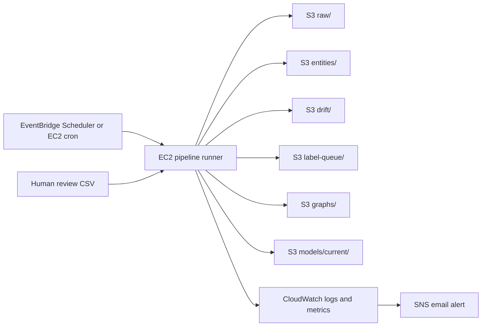

# Manual AWS Architecture Guide

This guide is the manual AWS deployment path for the AI News Entity Intelligence Platform.
It is intentionally simpler than the original proposal, but it still satisfies the core project criteria:

- Ingest live AI news.
- Store raw and transformed artifacts in cloud storage.
- Run NER and domain-specific `MODEL` entity extraction.
- Track drift metrics and low-confidence label candidates.
- Generate graph/dashboard outputs.
- Fine-tune, evaluate, gate, and promote a model.
- Keep the path simple enough to debug before Terraform.

The recommended order is:

1. Prove the cloud data path with S3 and one EC2 runner.
2. Add scheduling with either cron or EventBridge Scheduler.
3. Add CloudWatch/SNS alerts.
4. Add Step Functions only after the single EC2 command works.
5. Move the working manual setup into Terraform.

## Architecture Decision

### Recommended Manual Architecture



This is not one-to-one with the proposal. That is a good thing for the manual phase.
The proposal is the final architecture. The manual goal is to get a working, explainable AWS version with minimal moving parts.

### What We Are Simplifying

- Use one EC2 instance for ingestion, NER, drift, dashboard generation, fine-tuning, and evaluation.
- Use S3 as the source of truth for all artifacts.
- Use the generated static dashboard HTML first, instead of building a Streamlit service immediately.
- Use EC2 training first, not SageMaker. SageMaker can be added later if we want a managed training job.
- Use DynamoDB later only if dashboard queries become slow or if the professor expects a query index.
- Use Step Functions later for orchestration visibility, not on day one.

### Why This Still Meets The Criteria

- MLOps loop exists: data ingestion, inference, monitoring, label queue, training, evaluation gate, promotion.
- Cloud architecture exists: EC2 compute, S3 artifact store, IAM roles, CloudWatch/SNS monitoring, optional EventBridge/Step Functions orchestration.
- Drift-aware behavior exists: confidence metrics, flagged-span percentage, label queue size, retrain gate.
- Reproducibility exists: once manual steps work, Terraform can encode the exact same choices.

## Service Selection

| Requirement | Recommended service | Why |
|---|---|---|
| Artifact storage | S3 | Simple, durable, cheap, matches current code paths. |
| Compute | EC2 | Lowest complexity because current scripts are normal Python files. |
| Credentials | IAM role for EC2 | Avoids hardcoding AWS keys on the instance. |
| Remote shell | Systems Manager Session Manager plus optional SSH | Safer than open SSH; SSH is acceptable if restricted to your IP. |
| Scheduling | EC2 cron first, EventBridge Scheduler second | Cron is easiest to debug; EventBridge is better for cloud-native scheduling. |
| Orchestration | Step Functions Standard, optional | Useful visual execution history after the base script works. |
| Logs/metrics | CloudWatch | Required for drift monitoring and pipeline observability. |
| Alerts | SNS email topic | Simple alert fan-out for drift or failed runs. |
| Query index | DynamoDB, optional | Useful later for fast entity lookup, not required for static dashboard. |
| Training | EC2 first, SageMaker optional | EC2 keeps the project easier to reason about. |
| IaC | Terraform after manual success | Terraform should encode decisions, not hide debugging. |

## Phase 0: Safety And Cost Controls

Do this before launching anything.

### Create A Budget

AWS Console:

1. Open `Billing and Cost Management`.
2. Go to `Budgets`.
3. Choose `Create budget`.
4. Budget type: `Cost budget`.
5. Period: `Monthly`.
6. Amount: choose a small project limit, for example `20 USD` or your real limit.
7. Alert 1: `Actual cost`, threshold `50%`.
8. Alert 2: `Forecasted cost`, threshold `80%`.
9. Notification email: your email.

Why: EC2 GPU instances are not free-tier. A budget is the seatbelt before we touch compute.

### Choose Region

Recommended: `us-east-1`.

Why:

- It is commonly supported across AWS services.
- EC2 instance availability is usually broad.
- Existing repo defaults already use `us-east-1`.

Keep all resources in one region during the manual phase.

## Phase 1: Create The S3 Bucket

Create one bucket:

```text
ai-news-mlops-<your-name>-<year>
```

Example:

```text
ai-news-mlops-gaurav-2026
```

AWS Console path:

1. Open `S3`.
2. Choose `Create bucket`.
3. Bucket type: `General purpose`.
4. Bucket name: globally unique name.
5. Region: `us-east-1`.
6. Object ownership: `ACLs disabled`.
7. Block Public Access: keep `Block all public access` enabled.
8. Bucket Versioning: `Enable`.
9. Default encryption: `Server-side encryption with Amazon S3 managed keys (SSE-S3)`.
10. Object Lock: `Disable`.
11. Tags:
    - `Project = ai-news-mlops`
    - `Environment = manual`
    - `Owner = gaurav`

Why these choices:

- `ACLs disabled`: modern S3 access should use IAM policies, not object ACLs.
- `Block all public access`: pipeline data and labels should not be public.
- `Versioning enabled`: useful for model rollback and accidental overwrite recovery.
- `SSE-S3`: encrypted by default without KMS policy complexity.
- `Object Lock disabled`: not needed and can make cleanup harder.

### Create Prefixes

S3 does not require real folders, but create these prefixes for clarity:

```text
raw/
processed/
entities/
drift/
label-queue/
labeled/
review/
eval/
graphs/
models/current/
models/candidate/
logs/
```

Why: these match the local `local_data/` structure and the code's prefix constants.

### Lifecycle Rules

Create lifecycle rules under `S3 > bucket > Management > Lifecycle rules`.

Rule 1:

```text
Name: expire-raw-data
Scope: prefix raw/
Expire current versions after: 30 days
Expire noncurrent versions after: 30 days
```

Rule 2:

```text
Name: expire-label-queue
Scope: prefix label-queue/
Expire current versions after: 60 days
Expire noncurrent versions after: 60 days
```

Rule 3:

```text
Name: keep-models
Scope: prefix models/
Action: no expiration
```

Why:

- Raw RSS batches are reproducible enough to expire for an entry-level project.
- Label queue files should not live forever after review.
- Models should not expire automatically.

## Phase 2: Create IAM Role For EC2

Do not put AWS access keys on EC2. Use an IAM role.

AWS Console path:

1. Open `IAM`.
2. Go to `Roles`.
3. Choose `Create role`.
4. Trusted entity type: `AWS service`.
5. Use case: `EC2`.
6. Role name:

```text
ai-news-mlops-ec2-role
```

Attach AWS managed policy:

```text
AmazonSSMManagedInstanceCore
```

Why: this enables Systems Manager Session Manager and Run Command.

Add this inline policy. Replace bucket name and account/region values where needed.

```json
{
  "Version": "2012-10-17",
  "Statement": [
    {
      "Sid": "PipelineBucketList",
      "Effect": "Allow",
      "Action": [
        "s3:ListBucket"
      ],
      "Resource": "arn:aws:s3:::ai-news-mlops-gaurav-2026"
    },
    {
      "Sid": "PipelineBucketObjects",
      "Effect": "Allow",
      "Action": [
        "s3:GetObject",
        "s3:PutObject",
        "s3:DeleteObject",
        "s3:GetObjectVersion"
      ],
      "Resource": "arn:aws:s3:::ai-news-mlops-gaurav-2026/*"
    },
    {
      "Sid": "PipelineCloudWatchMetrics",
      "Effect": "Allow",
      "Action": [
        "cloudwatch:PutMetricData"
      ],
      "Resource": "*",
      "Condition": {
        "StringEquals": {
          "cloudwatch:namespace": "AI/NewsNER"
        }
      }
    }
  ]
}
```

Why:

- S3 permissions are limited to this project bucket.
- CloudWatch metric write is limited to the project namespace.
- No broad administrator permissions are needed.

Later, if SNS is added, attach a small extra permission:

```json
{
  "Effect": "Allow",
  "Action": "sns:Publish",
  "Resource": "arn:aws:sns:us-east-1:<account-id>:ai-news-mlops-alerts"
}
```

## Phase 3: Launch EC2

### Instance Choice

Recommended first manual instance:

```text
t3.xlarge
```

Why:

- 4 vCPU and 16 GiB RAM is enough to run BERT inference, graph generation, and small fine-tuning experiments.
- No CUDA/GPU driver complexity.
- Easier to debug than GPU on first AWS run.

Lower-cost fallback:

```text
t3.large
```

Use only if cost is tight. It has less memory, and transformer workloads may feel cramped.

GPU upgrade after CPU version works:

```text
g4dn.xlarge
```

Why:

- 1 NVIDIA T4 GPU.
- 4 vCPU.
- 16 GiB RAM.
- Better for BERT inference and small-scale training.
- More expensive and requires correct GPU/PyTorch setup.

Do not use:

```text
t2.micro
t3.micro
```

Why: the model and Python environment are too heavy for a reliable project demo.

### EC2 Console Settings

AWS Console path:

1. Open `EC2`.
2. Choose `Launch instance`.
3. Name:

```text
ai-news-mlops-runner
```

4. AMI:

```text
Ubuntu Server 22.04 LTS x86_64
```

Use a Deep Learning AMI later only if we move to GPU.

5. Instance type:

```text
t3.xlarge
```

6. Key pair:

Create or choose a key pair only if using SSH.

Recommended name:

```text
ai-news-mlops-key
```

7. Network:

Use the default VPC for manual phase.

8. Auto-assign public IP:

Enable if you want SSH or browser access to the dashboard.

9. Security group:

Create:

```text
ai-news-mlops-sg
```

Inbound rules:

```text
SSH      TCP 22    Your IP only
Custom   TCP 8501  Your IP only
Custom   TCP 8000  Your IP only
```

Outbound:

```text
All traffic   0.0.0.0/0
```

Why:

- Port 22 is only for SSH.
- Port 8501 can be used later for Streamlit.
- Port 8000 can serve the generated static dashboard with Python's HTTP server.
- Never use `0.0.0.0/0` for SSH in this project.

10. Storage:

```text
Root volume: 100 GiB
Type: gp3
Encrypted: yes
Delete on termination: yes
```

Why:

- Hugging Face models, Python packages, graph HTML, and local cache need disk.
- 100 GiB gives breathing room without design complexity.

11. Advanced details:

IAM instance profile:

```text
ai-news-mlops-ec2-role
```

Metadata version:

```text
IMDSv2 required
```

Termination protection:

```text
Enable during manual setup
```

Why:

- The role gives S3/SSM permissions.
- IMDSv2 improves metadata security.
- Termination protection prevents accidental deletion during setup.

## Phase 4: Prepare EC2

Connect with SSH or Session Manager.

SSH example:

```bash
ssh -i ai-news-mlops-key.pem ubuntu@<ec2-public-ip>
```

Install system packages:

```bash
sudo apt-get update -y
sudo apt-get install -y git python3-venv python3-pip unzip jq
```

Install AWS CLI if missing:

```bash
aws --version
```

If missing:

```bash
curl "https://awscli.amazonaws.com/awscli-exe-linux-x86_64.zip" -o "awscliv2.zip"
unzip awscliv2.zip
sudo ./aws/install
aws --version
```

Clone or upload the repo:

```bash
mkdir -p /opt/ai-news-mlops
cd /opt/ai-news-mlops
git clone <your-repo-url> MLOps
cd MLOps
```

If the repo is not on GitHub yet, manually copy it first, then replace this with `git clone` later.

Create Python environment:

```bash
python3 -m venv .venv
source .venv/bin/activate
python -m pip install --upgrade pip
pip install -r requirements.txt
```

Set environment variables:

```bash
cat <<'EOF' >> ~/.bashrc
export LOCAL_MODE=false
export S3_BUCKET=ai-news-mlops-gaurav-2026
export AWS_DEFAULT_REGION=us-east-1
export LABEL_CONFIDENCE_THRESH=0.85
export DRIFT_LOW_CONFIDENCE_THRESH=0.70
EOF
source ~/.bashrc
```

Verify AWS identity:

```bash
aws sts get-caller-identity
```

Expected: it should show the EC2 role, not your personal access key.

Verify bucket access:

```bash
aws s3 ls s3://$S3_BUCKET/
```

## Phase 5: First Manual Cloud Run

Run one stage at a time first.

```bash
source .venv/bin/activate
export LOCAL_MODE=false
export S3_BUCKET=ai-news-mlops-gaurav-2026
export AWS_DEFAULT_REGION=us-east-1

python ingest.py
aws s3 ls s3://$S3_BUCKET/raw/ --recursive
```

Then:

```bash
python NER.py
aws s3 ls s3://$S3_BUCKET/entities/ --recursive
aws s3 ls s3://$S3_BUCKET/drift/ --recursive
aws s3 ls s3://$S3_BUCKET/label-queue/ --recursive
```

Then:

```bash
python drift.py || true
aws s3 ls s3://$S3_BUCKET/drift/reports/ --recursive
```

Why `|| true`:

- Current `drift.py` exits with code `1` when drift is detected.
- In a shell pipeline, drift is a business signal, not always a broken script.
- Later orchestration should treat exit code `1` from drift as "drift detected", not "pipeline crashed".

## Phase 6: Generate Graph And Dashboard On EC2

The storage helpers write JSON to S3, but `graph.py` and `dashboard.py` currently read a local directory.
So sync S3 artifacts down to EC2, generate HTML locally, then upload the HTML back to S3.

```bash
mkdir -p local_data
aws s3 sync s3://$S3_BUCKET/raw local_data/raw --quiet
aws s3 sync s3://$S3_BUCKET/entities local_data/entities --quiet
aws s3 sync s3://$S3_BUCKET/drift local_data/drift --quiet
aws s3 sync s3://$S3_BUCKET/label-queue local_data/label-queue --quiet

python graph.py --dir local_data
python dashboard.py --dir local_data

aws s3 sync local_data/graphs s3://$S3_BUCKET/graphs --exclude "*" --include "*.html"
```

Serve the dashboard from EC2 for a quick demo:

```bash
cd /opt/ai-news-mlops/MLOps/local_data/graphs
python3 -m http.server 8000
```

Open:

```text
http://<ec2-public-ip>:8000/
```

Security reminder:

- Port `8000` must be open only to your IP.
- Do not make the S3 bucket public just to view the dashboard.

## Phase 7: Create A Reusable EC2 Pipeline Script

Create:

```bash
nano /opt/ai-news-mlops/run_cloud_pipeline.sh
```

Paste:

```bash
#!/usr/bin/env bash
set -euo pipefail

cd /opt/ai-news-mlops/MLOps
source .venv/bin/activate

export LOCAL_MODE=false
export S3_BUCKET=ai-news-mlops-gaurav-2026
export AWS_DEFAULT_REGION=us-east-1
export LABEL_CONFIDENCE_THRESH=0.85
export DRIFT_LOW_CONFIDENCE_THRESH=0.70

echo "[PIPELINE] start $(date -u)"

python ingest.py
python NER.py

set +e
python drift.py
DRIFT_STATUS=$?
set -e

if [ "$DRIFT_STATUS" -gt 1 ]; then
  echo "[PIPELINE] drift.py failed unexpectedly with code $DRIFT_STATUS"
  exit "$DRIFT_STATUS"
fi

mkdir -p local_data
aws s3 sync "s3://$S3_BUCKET/raw" local_data/raw --quiet
aws s3 sync "s3://$S3_BUCKET/entities" local_data/entities --quiet
aws s3 sync "s3://$S3_BUCKET/drift" local_data/drift --quiet
aws s3 sync "s3://$S3_BUCKET/label-queue" local_data/label-queue --quiet

python graph.py --dir local_data
python dashboard.py --dir local_data
aws s3 sync local_data/graphs "s3://$S3_BUCKET/graphs" --exclude "*" --include "*.html" --quiet

if [ "$DRIFT_STATUS" -eq 1 ]; then
  echo "[PIPELINE] drift detected; check s3://$S3_BUCKET/drift/alerts/"
else
  echo "[PIPELINE] no drift detected"
fi

echo "[PIPELINE] complete $(date -u)"
```

Make executable:

```bash
chmod +x /opt/ai-news-mlops/run_cloud_pipeline.sh
```

Run:

```bash
/opt/ai-news-mlops/run_cloud_pipeline.sh
```

Log it:

```bash
/opt/ai-news-mlops/run_cloud_pipeline.sh 2>&1 | tee -a /opt/ai-news-mlops/pipeline.log
```

## Phase 8: Scheduling Option Selection

### Option A: EC2 Cron

Recommended for the first working AWS version.

```bash
crontab -e
```

Add:

```text
0 * * * * /opt/ai-news-mlops/run_cloud_pipeline.sh >> /opt/ai-news-mlops/pipeline.log 2>&1
```

Why:

- Very easy to understand.
- Easy to debug with one log file.
- No Step Functions/SSM permissions yet.

Downside:

- Less cloud-native.
- No visual workflow history.

### Option B: EventBridge Scheduler To SSM Run Command

Use after the script works manually.

AWS Console:

1. Open `Amazon EventBridge Scheduler`.
2. Choose `Create schedule`.
3. Name:

```text
ai-news-mlops-hourly
```

4. Schedule pattern:

```text
rate(1 hour)
```

5. Flexible time window:

```text
Off
```

6. Target:

```text
AWS Systems Manager SendCommand
```

7. Document:

```text
AWS-RunShellScript
```

8. Target instance:

```text
ai-news-mlops-runner
```

9. Command:

```bash
/opt/ai-news-mlops/run_cloud_pipeline.sh >> /opt/ai-news-mlops/pipeline.log 2>&1
```

Why:

- Keeps scheduling in AWS instead of inside the instance.
- Works well with Systems Manager Run Command.
- Still simpler than Step Functions.

### Option C: EventBridge Scheduler To Step Functions To SSM

Use this for the polished architecture/demo after Option A or B works.

Choose Step Functions `Standard`, not `Express`.

Why:

- Standard workflows are better for long-running, auditable pipelines.
- The execution graph helps debugging.
- State transitions should be low enough for this project.

High-level state machine:

```text
Start
  -> Send SSM command
  -> Wait 60 seconds
  -> Get command invocation
  -> If Success: Done
  -> If InProgress/Pending: Wait again
  -> If Failed/TimedOut/Cancelled: Fail
```

Important: do not split every Python script into Step Functions states first.
Run the single tested shell script from Step Functions. Once stable, split stages if needed.

## Phase 9: CloudWatch And SNS

### Create SNS Topic

AWS Console:

1. Open `SNS`.
2. Create topic.
3. Type: `Standard`.
4. Name:

```text
ai-news-mlops-alerts
```

5. Create email subscription.
6. Confirm the subscription from your email.

Why: this gives a simple human alert path.

### CloudWatch Logs

Entry-level path:

- Keep `/opt/ai-news-mlops/pipeline.log`.
- Use SSM Run Command output history.

Better path:

- Install CloudWatch Agent.
- Ship `/opt/ai-news-mlops/pipeline.log` to CloudWatch Logs group:

```text
/ai-news-mlops/pipeline
```

### CloudWatch Metrics

The current code writes drift reports to:

```text
s3://<bucket>/drift/reports/
```

For the first AWS run, this is enough.

Next improvement:

- Add a small script that reads the newest drift report.
- Publishes these custom metrics to namespace `AI/NewsNER`:
  - `MeanConfidence`
  - `FlaggedSpanPercentage`
  - `LabelQueueSize`
  - `DriftDetected`

Then create alarms:

```text
MeanConfidence < 0.72 for 3 datapoints
FlaggedSpanPercentage > 30 for 2 datapoints
LabelQueueSize >= 15 for 1 datapoint
```

For entry-level simplicity, start with one alarm:

```text
DriftDetected >= 1
```

Why:

- The proposal's composite alarm is good, but it is more complex.
- A single `DriftDetected` metric is easier to explain and debug.

## Phase 10: Manual Label Review And Training

Training remains human-gated because labels must be reviewed.
That is acceptable and honest for this project.

Sync queue locally on EC2:

```bash
cd /opt/ai-news-mlops/MLOps
source .venv/bin/activate

export LOCAL_MODE=true
aws s3 sync "s3://$S3_BUCKET/label-queue" local_data/label-queue --quiet
python label_review.py export --limit 200
aws s3 cp local_data/review/label_review.csv "s3://$S3_BUCKET/review/label_review.csv"
```

Download CSV to your laptop:

```powershell
aws s3 cp s3://ai-news-mlops-gaurav-2026/review/label_review.csv .
```

Edit the CSV:

```text
status=accept   when predicted entity/type is correct
status=correct  when span is useful but needs corrected_entity or corrected_type
status=reject   when span is junk
split=train     for training samples
split=eval      for held-out evaluation samples
```

Upload reviewed CSV:

```powershell
aws s3 cp .\label_review.csv s3://ai-news-mlops-gaurav-2026/review/label_review.csv
```

On EC2:

```bash
cd /opt/ai-news-mlops/MLOps
source .venv/bin/activate
export LOCAL_MODE=true

aws s3 cp "s3://$S3_BUCKET/review/label_review.csv" local_data/review/label_review.csv
python label_review.py build-datasets

aws s3 sync local_data/labeled "s3://$S3_BUCKET/labeled"
aws s3 sync local_data/eval "s3://$S3_BUCKET/eval"
```

Train candidate:

```bash
python train.py --epochs 1 --max-samples 100 --overwrite
```

Evaluate current and candidate:

```bash
aws s3 sync "s3://$S3_BUCKET/models/current" local_data/models/current --quiet || true

python eval.py --model-prefix models/current --upload-results --current-result
python eval.py --model-prefix models/candidate --upload-results --candidate-result
python eval.py --check-gate
```

If gate passes:

```bash
python promote_model.py
aws s3 sync local_data/models/current "s3://$S3_BUCKET/models/current" --delete
aws s3 sync local_data/eval "s3://$S3_BUCKET/eval"
```

Why this works:

- `train.py` and `promote_model.py` are local-disk workflows today.
- S3 remains the cloud source of truth after sync.
- `NER.py` now uses `models/current` when present, so the next cloud NER run uses the promoted model.

## Phase 11: DynamoDB Decision

Do not add DynamoDB on day one.

Add it only if one of these becomes true:

- The dashboard needs fast search like "show all MODEL entities in week 16".
- The professor expects a cloud database/index in the architecture.
- S3 JSON scanning becomes too slow.

If adding DynamoDB, create one table:

```text
Table name: ai_news_entities
Partition key: entity_key (String)
Sort key: week (String)
Capacity mode: On-demand
```

Recommended item shape:

```json
{
  "entity_key": "model#gpt-5",
  "week": "2026-W16",
  "entity": "GPT-5",
  "type": "MODEL",
  "mentions": 12,
  "mean_confidence": 0.84,
  "first_seen": "2026-W16",
  "last_seen": "2026-W16"
}
```

Why on-demand:

- No capacity planning.
- Pay per request.
- Good for small, unpredictable project traffic.

## Phase 12: SageMaker Decision

Do not use SageMaker for the first manual AWS version.

Use EC2 training first because:

- Current code already trains locally.
- EC2 keeps all debugging in one place.
- SageMaker requires training containers, input channels, output paths, IAM permissions, and job configs.

Add SageMaker later if:

- EC2 training takes too long.
- You want managed training job logs/artifacts.
- The final report needs a stronger managed-MLOps story.

If added later, SageMaker should be the training-only component:

```text
S3 labeled/ + eval/
  -> SageMaker training job
  -> S3 models/candidate/
  -> EC2 or Step Functions eval gate
  -> S3 models/current/
```

## Phase 13: Debugging Checklist

### S3 Access Fails

Check:

```bash
aws sts get-caller-identity
aws s3 ls s3://$S3_BUCKET/
```

Likely causes:

- EC2 role not attached.
- Wrong bucket name.
- IAM policy has old bucket ARN.
- Region mismatch is less common for S3 but still check config.

### NER Is Slow

Check instance size:

```bash
free -h
nproc
```

If CPU is overloaded:

- Move from `t3.large` to `t3.xlarge`.
- If still slow, test `g4dn.xlarge`.

### Dashboard Missing Data

Check local sync:

```bash
find local_data/entities -name "*.json" | head
find local_data/drift -name "*.json" | head
```

Then regenerate:

```bash
python dashboard.py --dir local_data
```

### Drift Script Makes Scheduler Look Failed

Expected:

- Exit code `1` means drift detected.

Fix:

- Use the wrapper script in this guide.
- Do not schedule `python drift.py` directly as the entire job.

### Fine-Tuned Model Not Used

Check S3:

```bash
aws s3 ls "s3://$S3_BUCKET/models/current/" --recursive
```

Expected files include:

```text
config.json
model.safetensors
tokenizer.json
tokenizer_config.json
vocab.txt
```

If missing:

```bash
aws s3 sync local_data/models/current "s3://$S3_BUCKET/models/current" --delete
```

### EC2 Dashboard Cannot Be Opened

Check:

```bash
curl http://localhost:8000/
```

If local works but browser fails:

- Security group does not allow port `8000` from your IP.
- EC2 public IP changed after stop/start.
- Python HTTP server is not running.

## Phase 14: What To Terraform Later

Do not write Terraform until the manual architecture works.

Terraform should encode:

- S3 bucket.
- S3 lifecycle rules.
- IAM role and policies.
- EC2 security group.
- EC2 instance.
- Optional SNS topic.
- Optional EventBridge Scheduler.
- Optional Step Functions state machine.
- Optional DynamoDB table.
- Optional CloudWatch alarms.

The current `main.tf` is only a starting point. It must be updated before being considered equivalent to this guide.

## Final Manual AWS Acceptance Criteria

The manual AWS setup is complete when all are true:

- `python ingest.py` writes to `s3://bucket/raw/`.
- `python NER.py` writes to `s3://bucket/entities/`, `drift/`, and `label-queue/`.
- `python drift.py` writes a drift report to S3.
- Dashboard HTML is generated on EC2 and uploaded to `s3://bucket/graphs/`.
- At least one reviewed label CSV creates `labeled/train_set.json` and `eval/test_set.json`.
- A candidate model can be trained on EC2.
- The candidate can be evaluated against current.
- Passing candidate can be promoted to `models/current`.
- A later `NER.py` run loads `models/current` instead of the base Hugging Face model.
- Scheduling runs without manual SSH.
- Logs are inspectable.
- Costs are protected by AWS Budget alerts.

## Sources Checked

- [S3 Block Public Access](https://docs.aws.amazon.com/AmazonS3/latest/userguide/access-control-block-public-access.html)
- [S3 default encryption](https://docs.aws.amazon.com/AmazonS3/latest/userguide/default-bucket-encryption.html)
- [IAM roles for EC2](https://docs.aws.amazon.com/AWSEC2/latest/UserGuide/iam-roles-for-amazon-ec2.html)
- [Systems Manager Session Manager](https://docs.aws.amazon.com/systems-manager/latest/userguide/session-manager.html)
- [Systems Manager Run Command](https://docs.aws.amazon.com/systems-manager/latest/userguide/execute-remote-commands.html)
- [EventBridge Scheduler](https://docs.aws.amazon.com/eventbridge/latest/userguide/using-eventbridge-scheduler.html)
- [EventBridge Scheduler to Step Functions](https://docs.aws.amazon.com/step-functions/latest/dg/using-eventbridge-scheduler.html)
- [Step Functions service integrations](https://docs.aws.amazon.com/step-functions/latest/dg/concepts-service-integrations.html)
- [Step Functions workflow types](https://docs.aws.amazon.com/step-functions/latest/dg/choosing-workflow-type.html)
- [Step Functions pricing](https://aws.amazon.com/step-functions/pricing/)
- [DynamoDB on-demand capacity mode](https://docs.aws.amazon.com/amazondynamodb/latest/developerguide/on-demand-capacity-mode.html)
- [CloudWatch PutMetricData](https://docs.aws.amazon.com/AmazonCloudWatch/latest/APIReference/API_PutMetricData.html)
- [AWS Budgets](https://docs.aws.amazon.com/cost-management/latest/userguide/create-cost-budget.html)
- [EC2 G4 instances](https://aws.amazon.com/ec2/instance-types/g4/)
