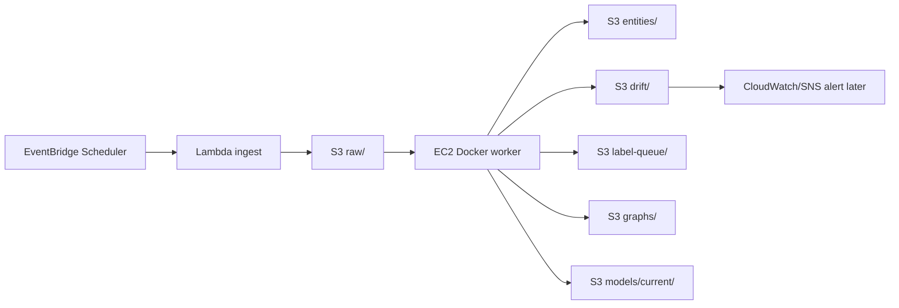

# Beginner Docker, AWS, And Git Guide

Start here if Docker, Git, Lambda, and EC2 still feel like too many moving pieces.

This guide explains:

- What each tool does.
- Why we use it in the MLOps pipeline.
- What to run.
- What should happen after each step.
- How each step helps the bigger architecture.

After this guide, choose one deployment variant:

- [AWS_LEARNER_LAB_DOCKER_TUTORIAL.md](/C:/Users/gaurav/OneDrive/Desktop/MLOps/AWS_LEARNER_LAB_DOCKER_TUTORIAL.md) for AWS Academy Learner Lab.
- [AWS_FREE_TIER_DOCKER_TUTORIAL.md](/C:/Users/gaurav/OneDrive/Desktop/MLOps/AWS_FREE_TIER_DOCKER_TUTORIAL.md) for a normal AWS account.

## Big Picture

The project has two kinds of work:

```text
Light work:
  ingest.py
  Fetch RSS news and write raw JSON to S3.

Heavy work:
  NER.py
  drift.py
  graph.py
  dashboard.py
  train.py
  eval.py
  promote_model.py
  Load BERT/Torch, process data, build dashboard, train/evaluate model.
```

AWS architecture:



Why this split:

- Lambda is good for small, quick jobs.
- EC2 is better for heavy ML jobs.
- Docker makes EC2 repeatable.
- S3 keeps data safe even when EC2 stops.
- GitHub keeps your code versioned and lets EC2 pull the latest code.

## Mental Model

### Git

Git answers:

```text
Which version of the code are we using?
```

You will have three copies of the repo:

```text
Local laptop repo:
  Where Codex and you edit code.

GitHub repo:
  Shared remote source of truth for code.

EC2 repo:
  Cloud machine clone that runs the code.
```

The normal flow:

```text
Laptop changes
-> git commit
-> git push
-> EC2 git pull
-> EC2 runs updated code
```

Why this matters:

- If a fix exists only on your laptop, EC2 cannot use it.
- If EC2 has an old clone, it may fail with old bugs.
- Git creates a clear audit trail for the project report.

### Docker

Docker answers:

```text
How do we run the same Python environment everywhere?
```

Important Docker words:

| Word | Meaning | In this project |
|---|---|---|
| `Dockerfile` | Recipe for the environment | Python 3.11, Torch, Transformers, project files |
| Image | Built environment snapshot | `ai-news-mlops:latest` |
| Container | A running copy of the image | Runs `python NER.py` or `python drift.py` |
| Volume | Folder shared between EC2 and container | `local_data/` and Hugging Face cache |
| `.env` | Environment variables file | S3 bucket, AWS region, thresholds |
| `.dockerignore` | Files excluded from image build | Avoids copying models/cache/local data into image |

Without Docker:

```text
Install Python packages manually on EC2.
Hope versions match.
Debug dependency mismatch.
Repeat when EC2 changes.
```

With Docker:

```text
Build image once.
Run the same image each time.
Use the same dependencies every time.
```

### Lambda

Lambda answers:

```text
Can AWS run a small function without keeping EC2 on?
```

For us:

```text
lambda_ingest.py
-> imports ingest.py
-> fetches RSS feeds
-> writes raw JSON to S3
```

Why Lambda only for ingest:

- `ingest.py` is small.
- It does not need Torch or Transformers.
- It runs quickly.
- It saves EC2 credits because EC2 can stay stopped.

### EventBridge Scheduler

EventBridge Scheduler answers:

```text
When should Lambda run?
```

Example:

```text
rate(6 hours)
```

Means AWS invokes the ingest Lambda every six hours.

CloudWatch does not replace EventBridge Scheduler:

```text
EventBridge Scheduler = timing
CloudWatch = logs, metrics, alarms
SNS = email/message notification
```

### S3

S3 answers:

```text
Where does data live permanently?
```

Important prefixes:

```text
raw/           RSS article batches
entities/      NER outputs
drift/         confidence metrics and drift reports
label-queue/   uncertain spans for human review
labeled/       reviewed training data
eval/          evaluation results
graphs/        dashboard HTML
models/        candidate/current model artifacts
```

Why S3 matters:

- EC2 can stop and restart.
- Learner Lab sessions can end.
- S3 keeps the pipeline artifacts.
- Terraform can later recreate infrastructure around the same data layout.

## Phase 1: Git Workflow Before AWS

### Step 1. Check Current Branch And Changes

Run on your laptop:

```powershell
git status
git branch
```

Why:

- `git status` shows changed files.
- `git branch` shows where you are working.
- You should know this before pushing or pulling.

Expected:

```text
On branch main
Changes not staged for commit:
...
```

or:

```text
On branch codex/something
```

### Step 2. Create A Branch For The Work

Use a feature branch:

```powershell
git checkout -b codex/docker-aws-guides
```

Why:

- Keeps `main` stable.
- Lets you group related changes.
- Makes it safer to review and push.

If the branch already exists:

```powershell
git checkout codex/docker-aws-guides
```

### Step 3. Run Local Tests

```powershell
python -m pytest -q
```

Why:

- Tests catch obvious logic breaks before EC2.
- EC2 debugging is slower.
- This is your local quality gate.

Expected:

```text
13 passed
```

The `.pytest_cache` warning on Windows is not blocking if tests pass.

### Step 4. Review Changed Files

```powershell
git status --short
```

Why:

- Shows exactly what will be committed.
- Helps avoid committing `local_data/`, model files, or secrets.

Good files to commit:

```text
Dockerfile
.dockerignore
.env.example
lambda_ingest.py
scripts/run_cloud_pipeline_docker.sh
*.md guide files
source .py changes
```

Do not commit:

```text
.env
local_data/
AWS credentials
model.safetensors
large generated dashboards unless intentionally needed
```

### Step 5. Stage Files

```powershell
git add Dockerfile .dockerignore docker-compose.yml .env.example lambda_ingest.py scripts/run_cloud_pipeline_docker.sh
git add README.md GIT_WORKFLOW.md AWS_FREE_TIER_DOCKER_TUTORIAL.md AWS_LEARNER_LAB_DOCKER_TUTORIAL.md BEGINNER_DOCKER_AWS_GIT_GUIDE.md
git add NER.py
```

Why:

- Staging means "include these files in the next commit."
- It gives control over what becomes part of the version history.

Check:

```powershell
git status --short
```

### Step 6. Commit

```powershell
git commit -m "Add Docker AWS deployment guides"
```

Why:

- A commit is a named checkpoint.
- GitHub and EC2 can only pull committed code.

Good commit messages:

```text
Add Docker AWS deployment guides
Fix NER fallback for empty current model
Add Lambda ingest entry point
```

### Step 7. Push To GitHub

```powershell
git push -u origin codex/docker-aws-guides
```

Why:

- GitHub now has the code.
- EC2 can pull it after merge or by checking out the branch.

If you are working directly on `main`:

```powershell
git push origin main
```

For a clean project workflow, prefer branch -> pull request -> merge.

### Step 8. Update EC2

On EC2:

```bash
cd /opt/ai-news-mlops/MLOps
git pull
```

If using a branch:

```bash
git fetch origin
git checkout codex/docker-aws-guides
git pull
```

Why:

- EC2 must use the same code version you just tested.
- This prevents "but I fixed it locally" confusion.

## Phase 2: Prepare EC2 For Docker

### Step 1. Confirm OS User

Run:

```bash
whoami
cat /etc/os-release
```

Why:

- Amazon Linux usually uses `ec2-user`.
- Ubuntu usually uses `ubuntu`.
- Docker group commands depend on the username.

### Step 2. Install Docker

Amazon Linux 2023:

```bash
sudo dnf update -y
sudo dnf install docker git -y
sudo systemctl enable docker
sudo systemctl start docker
sudo usermod -aG docker $USER
newgrp docker
```

Why each command:

- `dnf update -y`: updates package metadata and system packages.
- `dnf install docker git -y`: installs Docker and Git.
- `systemctl enable docker`: starts Docker automatically after reboot.
- `systemctl start docker`: starts Docker now.
- `usermod -aG docker $USER`: lets your user run Docker without `sudo`.
- `newgrp docker`: applies group membership in the current terminal.

### Step 3. Verify Docker

```bash
docker --version
docker run --rm hello-world
```

Why:

- Confirms Docker service works.
- Confirms your user has permission.

Expected:

```text
Hello from Docker!
```

## Phase 3: Prepare The Project On EC2

### Step 1. Create Project Folder

```bash
sudo mkdir -p /opt/ai-news-mlops
sudo chown -R $USER:$USER /opt/ai-news-mlops
cd /opt/ai-news-mlops
```

Why:

- `/opt` is a normal place for app code on Linux servers.
- `chown` lets your user edit files there.

### Step 2. Clone Or Update Repo

If first time:

```bash
git clone https://github.com/st126522-rgb/MLOps.git
cd MLOps
```

If already cloned:

```bash
cd /opt/ai-news-mlops/MLOps
git pull
```

Why:

- EC2 needs the same repo files as your laptop.
- `git pull` brings new Docker files and code fixes.

### Step 3. Create `.env`

```bash
cp .env.example .env
nano .env
```

Use:

```text
LOCAL_MODE=false
S3_BUCKET=ai-news-mlops-2026
AWS_DEFAULT_REGION=us-east-1
LABEL_CONFIDENCE_THRESH=0.85
DRIFT_LOW_CONFIDENCE_THRESH=0.70
RUN_INGEST_IN_EC2=false
STOP_EC2_AFTER_RUN=false
```

Why:

- `.env` stores runtime settings.
- We do not hardcode bucket names into scripts.
- `.env` should not be committed because it can contain environment-specific values.

### Step 4. Check AWS Permissions

On EC2:

```bash
aws sts get-caller-identity
aws s3 ls s3://$S3_BUCKET/
```

If `$S3_BUCKET` is empty in shell, load `.env`:

```bash
set -a
source .env
set +a
aws s3 ls s3://$S3_BUCKET/
```

Why:

- `sts get-caller-identity` proves the IAM role works.
- `s3 ls` proves the EC2 instance can reach the bucket.

## Phase 4: Build The Docker Image

Run:

```bash
cd /opt/ai-news-mlops/MLOps
docker build -t ai-news-mlops:latest .
```

What happens:

- Docker reads `Dockerfile`.
- It downloads a Python base image.
- It installs project dependencies from `requirements.txt`.
- It copies project files into the image.
- It creates an image named `ai-news-mlops:latest`.

Why this helps:

- You do not need to manually manage Python packages on EC2.
- Torch/Transformers versions stay tied to the Docker image.
- Rebuilding the image is easier than debugging a broken virtual environment.

Expected:

```text
Successfully tagged ai-news-mlops:latest
```

If build is slow:

- First build is slow because Torch is large.
- Later builds use Docker cache.

## Phase 5: Test Docker Can Use AWS

Run:

```bash
docker run --rm --env-file .env ai-news-mlops:latest python -c "import boto3; print(boto3.client('sts').get_caller_identity())"
```

Why:

- Confirms code inside the container can use the EC2 IAM role.
- This is important because the ML scripts run inside Docker, not directly on EC2.

If this fails:

- Check EC2 IAM role exists.
- Check EC2 has network access.
- Check Docker can reach instance metadata.

## Phase 6: Test One Pipeline Stage At A Time

### Step 1. Ingest Test

Use this only before Lambda ingest is ready:

```bash
docker run --rm --env-file .env -v $(pwd)/local_data:/app/local_data -v ai_news_hf_cache:/cache/huggingface ai-news-mlops:latest python ingest.py
```

Then:

```bash
aws s3 ls s3://$S3_BUCKET/raw/ --recursive
```

Why:

- Proves the container can write raw data to S3.
- This is the simplest cloud data-path test.

### Step 2. NER Test

```bash
docker run --rm --env-file .env -v $(pwd)/local_data:/app/local_data -v ai_news_hf_cache:/cache/huggingface ai-news-mlops:latest python NER.py
```

Expected first run:

```text
Loading NER model: dslim/bert-base-NER
```

Expected after model promotion:

```text
Loading NER model: /tmp/...
```

Why:

- Proves Torch/Transformers works in Docker.
- Proves S3 raw data can be read.
- Proves entities, drift logs, and label queue can be written.

Check:

```bash
aws s3 ls s3://$S3_BUCKET/entities/ --recursive
aws s3 ls s3://$S3_BUCKET/drift/ --recursive
aws s3 ls s3://$S3_BUCKET/label-queue/ --recursive
```

### Step 3. Drift Test

```bash
docker run --rm --env-file .env -v $(pwd)/local_data:/app/local_data -v ai_news_hf_cache:/cache/huggingface ai-news-mlops:latest python drift.py
```

Important:

```text
Exit code 1 can mean drift was detected.
That is a business signal, not always a crash.
```

Why:

- Drift detection checks whether model confidence is degrading.
- It also checks whether enough label candidates exist to justify retraining.

## Phase 7: Use The Wrapper Script

After individual stages work:

```bash
chmod +x scripts/run_cloud_pipeline_docker.sh
RUN_INGEST_IN_EC2=true scripts/run_cloud_pipeline_docker.sh
```

Why:

- The wrapper combines the safe sequence.
- It handles `drift.py` exit code correctly.
- It syncs S3 artifacts for graph/dashboard generation.
- It uploads dashboard HTML back to S3.

After Lambda ingest works:

```bash
RUN_INGEST_IN_EC2=false scripts/run_cloud_pipeline_docker.sh
```

For Learner Lab stop-after-run:

```bash
STOP_EC2_AFTER_RUN=true scripts/run_cloud_pipeline_docker.sh
```

## Phase 8: Add Lambda Ingest

### Step 1. Build Lambda ZIP

```bash
mkdir -p lambda_build
python3 -m pip install feedparser -t lambda_build
cp lambda_ingest.py ingest.py config.py s3_utils.py lambda_build/
cd lambda_build
zip -r ../lambda_ingest.zip .
cd ..
```

Why:

- Lambda does not use the Docker image here.
- Ingest only needs `feedparser`.
- A ZIP package is simpler than ECR for entry-level deployment.

### Step 2. Create Lambda Function

Settings:

```text
Runtime: Python 3.11
Handler: lambda_ingest.handler
Memory: 256 MB
Timeout: 60 seconds
Environment:
  LOCAL_MODE=false
  S3_BUCKET=ai-news-mlops-2026
  AWS_DEFAULT_REGION=us-east-1
```

Why:

- Lambda runs `handler()` inside `lambda_ingest.py`.
- That calls `ingest.run()`.
- Raw article JSON is written to S3.

### Step 3. Test Lambda

Use test event:

```json
{}
```

Then:

```bash
aws s3 ls s3://$S3_BUCKET/raw/ --recursive
```

Why:

- Proves scheduled ingestion will work before adding a schedule.

## Phase 9: Add EventBridge Scheduler

Create scheduler:

```text
Name: ai-news-mlops-ingest-schedule
Schedule: rate(6 hours) for debugging, rate(1 hour) for demo
Target: Lambda function
Function: ai-news-mlops-ingest
Execution role: allows lambda:InvokeFunction
```

Why:

- EventBridge Scheduler is the "clock."
- Lambda is the "work."
- CloudWatch is the "logs and alarms."

Recommended:

```text
Learner Lab: rate(6 hours) first
Free Tier: rate(3 hours) first, then rate(1 hour) for demo
```

If no raw files appear:

- Test Lambda manually.
- Check Scheduler is enabled.
- Check Scheduler execution role.
- Check Lambda environment variables.

## Phase 10: Human-In-The-Loop Retraining

This is the active learning loop.

Pipeline:

```text
NER.py finds uncertain spans
-> writes label-queue/
-> human reviews CSV
-> build train/eval datasets
-> train candidate
-> evaluate candidate
-> promote only if F1 improves
```

Export review CSV:

```bash
aws s3 sync s3://$S3_BUCKET/label-queue local_data/label-queue --quiet
docker run --rm --env-file .env -v $(pwd)/local_data:/app/local_data ai-news-mlops:latest python label_review.py export --limit 200
```

Edit:

```text
local_data/review/label_review.csv
```

Use:

```text
status=accept   model span/type is correct
status=correct  span is useful but needs corrected_entity or corrected_type
status=reject   junk span
split=train     training example
split=eval      held-out evaluation example
```

Build datasets:

```bash
docker run --rm --env-file .env -v $(pwd)/local_data:/app/local_data ai-news-mlops:latest python label_review.py build-datasets
```

Train:

```bash
docker run --rm --env-file .env -v $(pwd)/local_data:/app/local_data -v ai_news_hf_cache:/cache/huggingface ai-news-mlops:latest python train.py --epochs 1 --max-samples 100 --overwrite
```

Evaluate:

```bash
docker run --rm --env-file .env -v $(pwd)/local_data:/app/local_data -v ai_news_hf_cache:/cache/huggingface ai-news-mlops:latest python eval.py --model-prefix models/current --upload-results --current-result
docker run --rm --env-file .env -v $(pwd)/local_data:/app/local_data -v ai_news_hf_cache:/cache/huggingface ai-news-mlops:latest python eval.py --model-prefix models/candidate --upload-results --candidate-result
docker run --rm --env-file .env -v $(pwd)/local_data:/app/local_data -v ai_news_hf_cache:/cache/huggingface ai-news-mlops:latest python eval.py --check-gate
```

Promote:

```bash
docker run --rm --env-file .env -v $(pwd)/local_data:/app/local_data ai-news-mlops:latest python promote_model.py
aws s3 sync local_data/models/current s3://$S3_BUCKET/models/current --delete
aws s3 sync local_data/eval s3://$S3_BUCKET/eval
```

Why:

- Do not train on raw uncertain predictions directly.
- Human review prevents the model from learning its own mistakes.
- F1 gate prevents bad candidates from becoming production models.

## Phase 11: Where Drift Fits

Current drift logic:

```text
NER.py records confidence scores.
drift.py computes rolling mean confidence and flagged span percentage.
If confidence is low or flagged percentage is high and label queue is large enough, drift is detected.
```

Cloud version:

```text
drift.py writes reports to S3.
Later CloudWatch metrics/alarms can alert when drift_detected=true.
SNS can email you.
Then you run human review and training.
```

Why not auto-train immediately:

- `label-queue/` contains uncertain model guesses.
- Training should use reviewed labels.
- The safer system is drift-triggered, human-gated retraining.

## Phase 12: Common Debugging

### EC2 Has Old Code

Symptom:

```text
File missing, Dockerfile missing, NER still loads empty models/current
```

Fix:

```bash
cd /opt/ai-news-mlops/MLOps
git pull
```

If the file is still missing, push from laptop first.

### Docker Permission Error

Fix:

```bash
sudo usermod -aG docker $USER
newgrp docker
```

### S3 Access Error

Check:

```bash
aws sts get-caller-identity
aws s3 ls s3://$S3_BUCKET/
```

If host works but container fails:

```bash
docker run --rm --env-file .env ai-news-mlops:latest python -c "import boto3; print(boto3.client('sts').get_caller_identity())"
```

### Disk Full

Check:

```bash
df -h
docker system df
```

Clean:

```bash
docker system prune -f
```

### Dashboard Missing Data

Run:

```bash
aws s3 sync s3://$S3_BUCKET/entities local_data/entities --quiet
aws s3 sync s3://$S3_BUCKET/drift local_data/drift --quiet
docker run --rm --env-file .env -v $(pwd)/local_data:/app/local_data ai-news-mlops:latest python dashboard.py --dir local_data
```

## Final Checklist

You are ready to move toward Terraform when:

- GitHub has the latest Docker and Lambda files.
- EC2 can `git pull` the repo.
- Docker builds successfully.
- Docker can access AWS credentials through the EC2 role.
- Lambda ingest writes raw files to S3.
- EventBridge Scheduler invokes Lambda on schedule.
- EC2 Docker worker processes raw files into entities/drift/graphs.
- Label review can produce train/eval datasets.
- Training, eval, and promotion work.
- S3 contains `models/current` after promotion.

