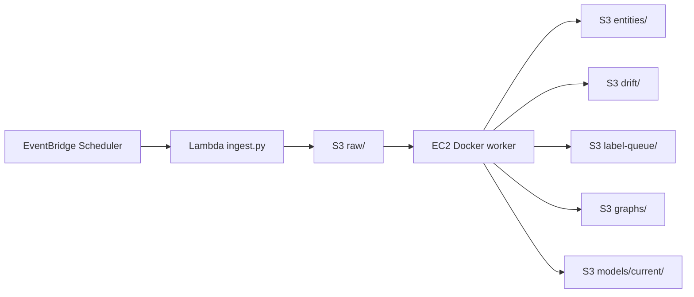

# MVP Launchpad

This is the practical starting point from where we are now.
The goal is not perfect AWS architecture yet.
The goal is a working, explainable end-to-end MVP that can later become Terraform.

## The MVP Strategy

Build in this order:

```text
1. Local Python pipeline test
2. Local Docker test
3. Git commit and push
4. S3 bucket setup
5. EC2 Docker worker setup
6. Ingest test from EC2
7. Lambda ingest test
8. EventBridge Scheduler for Lambda
9. EC2 Docker NER/drift/dashboard test
10. Human label review and retraining loop
11. Optional CloudWatch/SNS drift alert
12. Terraform only after manual version works
```

Why this order:

- Local test proves the code works before AWS.
- Docker test removes dependency/version mismatch.
- Git push makes EC2 able to pull the same code.
- S3 gives a permanent source of truth.
- EC2 Docker runs heavy ML safely.
- Lambda handles only lightweight ingest.
- EventBridge Scheduler gives the timed trigger.
- Drift/retraining comes after data is flowing.
- CloudWatch/SNS is the notification layer; it should tell the human to label, not train directly on unreviewed model guesses.

## Architecture For Bare-Bones MVP



Bare-bones means:

- No Glacier lifecycle rules yet.
- No complex bucket policy yet.
- No NAT Gateway.
- No Load Balancer.
- No RDS/OpenSearch.
- No SageMaker yet.
- No Step Functions yet.
- No public S3 bucket.
- No fully automatic retraining from unreviewed labels.

This is okay for the MVP.
We can still mention best practices in the report as future improvements.

## Free Tier vs Learner Lab Decision

### Free Tier / Personal AWS

Use proper IAM roles:

```text
EC2 role:
  ai-news-mlops-ec2-role
  S3 read/write to project bucket
  CloudWatch PutMetricData later
  SSM Managed Instance Core optional but recommended

Lambda role:
  ai-news-mlops-lambda-ingest-role
  S3 write to raw/
  CloudWatch Logs permissions

Scheduler role:
  ai-news-mlops-scheduler-lambda-role
  lambda:InvokeFunction for ingest Lambda
```

Why:

- This is closer to real AWS practice.
- It is easier to Terraform later.
- It prevents over-permissioned resources.
- It makes the architecture defensible in a report.

### Learner Lab

Use `LabRole` where the lab expects it.

For MVP, yes, using `LabRole` for multiple services is usually acceptable in Learner Lab:

```text
EC2 instance profile: LabRole
Lambda execution role: LabRole, if selectable
Scheduler execution role: LabRole, if it can invoke Lambda
```

But be careful:

- Learner Lab permissions vary by course.
- Some services or role assumptions may be blocked.
- If `LabRole` cannot be used by EventBridge Scheduler, create the smallest scheduler role allowed by the lab.
- Do not fight Learner Lab limitations for days. If something is blocked, document it and use manual EC2 execution.

Report wording:

```text
In the Learner Lab deployment, the provided LabRole was used for service execution where custom IAM role creation was restricted. In the Free Tier/personal AWS version, least-privilege roles are defined separately for EC2, Lambda, and Scheduler.
```

## First Start: Local Python Test

Run on your laptop:

```powershell
cd C:\Users\gaurav\OneDrive\Desktop\MLOps
python -m py_compile NER.py ingest.py lambda_ingest.py s3_utils.py
python -m pytest -q
```

Expected:

```text
13 passed
```

Why:

- This checks syntax and logic before AWS.
- If this fails, Docker/AWS will only make debugging harder.

Optional full local pipeline:

```powershell
python run_local.py --stage ingest
python run_local.py --stage ner
python run_local.py --stage drift
python run_local.py --stage dashboard
```

Why optional:

- `NER.py` loads a transformer model and can be slow.
- You already proved much of this locally, so use it when you want a fresh sanity check.

## Second Start: Local Docker Test

Run on your laptop if Docker Desktop is installed.
If not, do this on EC2 after Docker is installed.

```powershell
docker build -t ai-news-mlops:latest .
```

Then:

```powershell
docker run --rm ai-news-mlops:latest python -m py_compile NER.py ingest.py lambda_ingest.py s3_utils.py
```

Why:

- This confirms Docker can build the project environment.
- It catches version conflicts before the EC2 setup.
- If local Docker works, EC2 Docker should behave similarly.

If Docker is not installed locally:

```text
Skip local Docker.
Do Docker on EC2.
```

That is fine.

## Third Start: Git Commit And Push

Run:

```powershell
git status --short
git checkout -b codex/mvp-launchpad
git add .gitignore README.md GIT_WORKFLOW.md MVP_LAUNCHPAD.md
git add BEGINNER_DOCKER_AWS_GIT_GUIDE.md AWS_FREE_TIER_DOCKER_TUTORIAL.md AWS_LEARNER_LAB_DOCKER_TUTORIAL.md
git add Dockerfile .dockerignore docker-compose.yml .env.example lambda_ingest.py scripts/run_cloud_pipeline_docker.sh
git add NER.py
python -m pytest -q
git commit -m "Add MVP Docker AWS launchpad"
git push -u origin codex/mvp-launchpad
```

Why:

- EC2 must pull these files from GitHub.
- If the Docker fixes exist only locally, EC2 will keep failing with old code.

If you are not using branches and want to update `main` directly:

```powershell
git add .
git commit -m "Add MVP Docker AWS launchpad"
git push origin main
```

Branch workflow is cleaner, but direct `main` is simpler for a student MVP.

## Fourth Start: Create S3

Create one S3 bucket:

```text
ai-news-mlops-2026
```

For MVP settings:

```text
Block public access: enabled
Versioning: optional but recommended
Encryption: SSE-S3 default
Lifecycle/Glacier: skip for now
Complex bucket policy: skip for now
```

Create prefixes:

```text
raw/
entities/
drift/
label-queue/
labeled/
eval/
graphs/
models/current/
models/candidate/
review/
```

Why:

- S3 mirrors local `local_data/`.
- It becomes the cloud source of truth.
- EC2 and Lambda communicate through S3.

## Fifth Start: EC2 Setup

Use EC2 as the heavy worker.

Recommended Learner Lab:

```text
t3.large if allowed
t3.medium if t3.large is blocked
Stop EC2 when not using it
```

Recommended Free Tier / Personal AWS:

```text
t3.large for balanced MVP
t3.xlarge if you accept higher cost and want smoother BERT processing
```

Install Docker:

```bash
sudo dnf update -y
sudo dnf install docker git -y
sudo systemctl enable docker
sudo systemctl start docker
sudo usermod -aG docker $USER
newgrp docker
```

Clone:

```bash
sudo mkdir -p /opt/ai-news-mlops
sudo chown -R $USER:$USER /opt/ai-news-mlops
cd /opt/ai-news-mlops
git clone https://github.com/st126522-rgb/MLOps.git
cd MLOps
```

If already cloned:

```bash
cd /opt/ai-news-mlops/MLOps
git pull
```

Create `.env`:

```bash
cp .env.example .env
nano .env
```

Use:

```text
LOCAL_MODE=false
S3_BUCKET=ai-news-mlops-2026
AWS_DEFAULT_REGION=us-east-1
LABEL_CONFIDENCE_THRESH=0.85
DRIFT_LOW_CONFIDENCE_THRESH=0.70
RUN_INGEST_IN_EC2=true
STOP_EC2_AFTER_RUN=false
```

Build:

```bash
docker build -t ai-news-mlops:latest .
```

Why:

- Docker replaces fragile manual `pip install` setup.
- The same image runs NER, drift, graph, dashboard, train, eval.

## Sixth Start: Test Ingest From EC2 First

Before Lambda, test ingest from EC2 Docker:

```bash
docker run --rm --env-file .env -v $(pwd)/local_data:/app/local_data -v ai_news_hf_cache:/cache/huggingface ai-news-mlops:latest python ingest.py
aws s3 ls s3://$S3_BUCKET/raw/ --recursive
```

Why:

- This proves code, Docker, IAM, network, RSS, and S3 all work.
- It is easier to debug than Lambda.

If this works, then move ingest to Lambda.

## Seventh Start: Create Lambda Ingest

Lambda package:

```bash
mkdir -p lambda_build
python3 -m pip install feedparser -t lambda_build
cp lambda_ingest.py ingest.py config.py s3_utils.py lambda_build/
cd lambda_build
zip -r ../lambda_ingest.zip .
cd ..
```

Lambda settings:

```text
Runtime: Python 3.11
Handler: lambda_ingest.handler
Memory: 256 MB
Timeout: 60 seconds
Environment:
  LOCAL_MODE=false
  S3_BUCKET=ai-news-mlops-2026
  AWS_DEFAULT_REGION=us-east-1
```

Role:

```text
Free Tier: ai-news-mlops-lambda-ingest-role
Learner Lab: LabRole if custom role setup is restricted
```

Test Lambda manually before scheduling it.

Why:

- Lambda proves lightweight ingestion can happen without EC2 running.
- This is the first cloud-native automation piece.

## Eighth Start: Add EventBridge Scheduler

Create schedule:

```text
Name: ai-news-mlops-ingest-schedule
Schedule: rate(6 hours) first
Target: Lambda function
Function: ingest Lambda
```

Role:

```text
Free Tier: scheduler role with lambda:InvokeFunction
Learner Lab: LabRole if allowed
```

Why:

- EventBridge Scheduler is the clock.
- Lambda is the worker.
- CloudWatch is only for logs/metrics/alarms.

After schedule runs:

```bash
aws s3 ls s3://ai-news-mlops-2026/raw/ --recursive
```

## Ninth Start: Run EC2 Docker Processing

Once raw files exist in S3:

```bash
cd /opt/ai-news-mlops/MLOps
RUN_INGEST_IN_EC2=false scripts/run_cloud_pipeline_docker.sh
```

This runs:

```text
NER.py
drift.py
graph.py
dashboard.py
S3 sync for graphs
```

Check:

```bash
aws s3 ls s3://$S3_BUCKET/entities/ --recursive
aws s3 ls s3://$S3_BUCKET/drift/ --recursive
aws s3 ls s3://$S3_BUCKET/label-queue/ --recursive
aws s3 ls s3://$S3_BUCKET/graphs/ --recursive
```

For Learner Lab:

```bash
STOP_EC2_AFTER_RUN=true RUN_INGEST_IN_EC2=false scripts/run_cloud_pipeline_docker.sh
```

Why:

- EC2 becomes an on-demand ML worker.
- S3 keeps outputs after EC2 stops.

## Tenth Start: Human-In-The-Loop Retraining

Do this only after label queue has enough items.

```bash
bash scripts/run_retrain_cycle_docker.sh
```

Edit:

```text
local_data/review/label_review.csv
```

Then:

```bash
SKIP_EXPORT=true bash scripts/run_retrain_cycle_docker.sh
```

Why:

- Drift should trigger review/training, not train directly on uncertain predictions.
- Human review prevents model self-poisoning.
- F1 gate prevents bad promotion.
- The retrain script uploads candidate and promoted models to S3 in cloud mode, so future EC2 NER runs can load the promoted model automatically.

## MVP Acceptance Criteria

You have the MVP when:

- Local tests pass.
- Docker image builds.
- EC2 can run Docker.
- EC2 Docker can write raw files to S3.
- Lambda can write raw files to S3.
- EventBridge Scheduler triggers Lambda.
- EC2 Docker processes raw files into entities/drift/label-queue.
- Dashboard HTML is uploaded to S3.
- Human label review can create train/eval files.
- Candidate model can be trained/evaluated.
- Passing model can be promoted to `models/current`.

## What To Ignore Until Later

Skip these for MVP:

- Glacier lifecycle.
- Strict least-privilege bucket policies.
- Step Functions.
- SageMaker.
- DynamoDB.
- MLflow.
- Fully automatic retraining.
- Terraform.

Add them after the manual MVP works.
